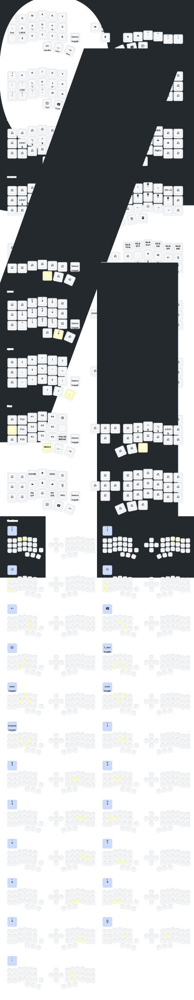

### `urob__leader_1`: Activate Functions

- `P` → `R`: Take a screenshot (`PRINTSCREEN`)  
- `SPACE`: Switch to layer 9  
- `TAB`: Switch to layer 4  
- `:` (COLON): Enable Caps Word  
- `A`: Activate Left Windows key (`LWIN`)  
- `S`: Activate Left Alt key (`LALT`)  
- `D`: Activate Left Control key (`LCTRL`)  
- `F`: Activate Left Shift key (`LSHFT`)  

### `urob__leader_2`: Deactivate Functions

- `A`: Deactivate `LWIN`  
- `S`: Deactivate `LALT`  
- `D`: Deactivate `LCTRL`  
- `F`: Deactivate `LSHFT`  

